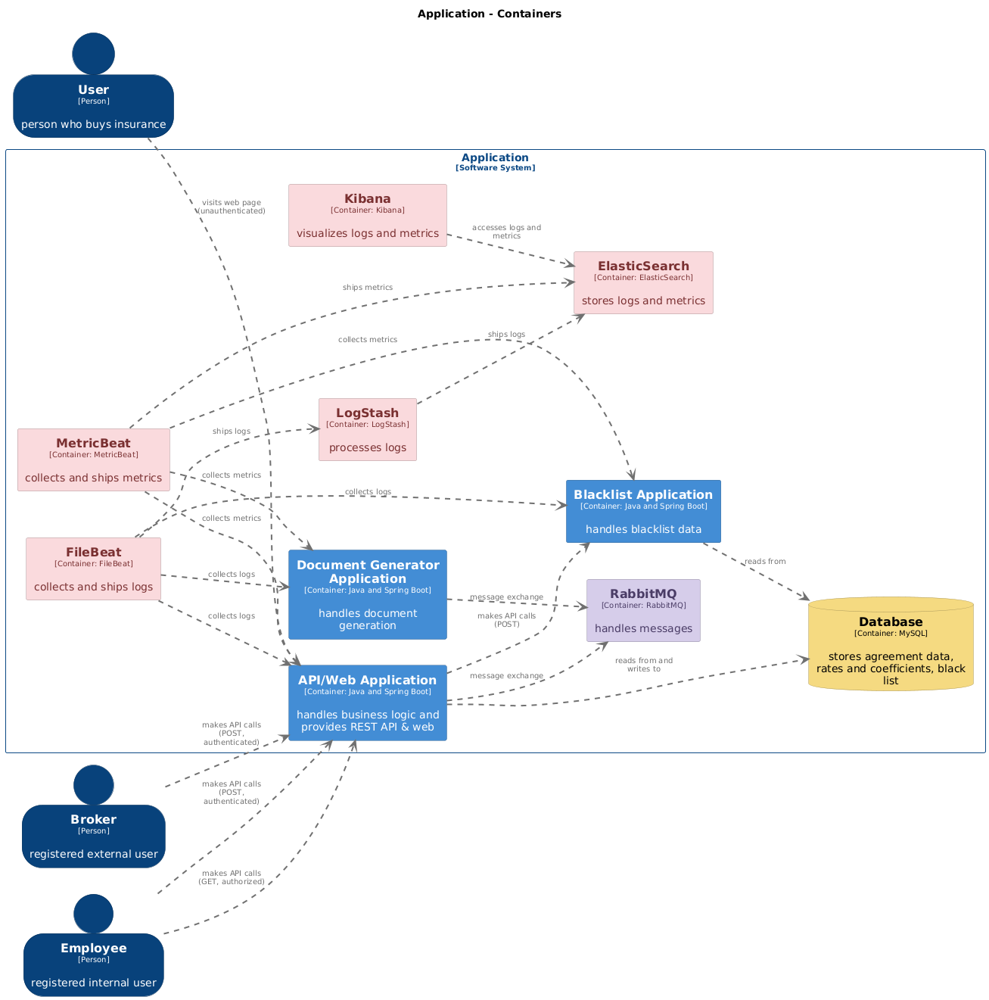
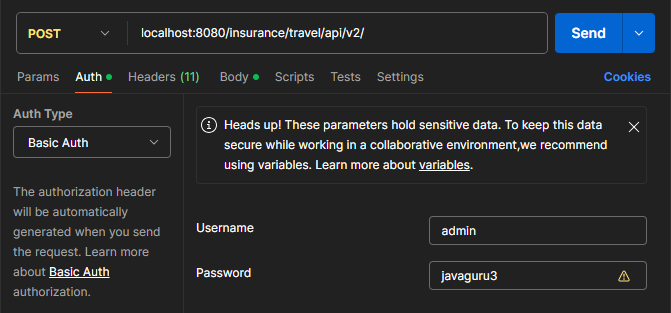

# Dockerized Microservices Demo
This repository contains a microservice architecture deployed in Docker containers. It demonstrates distributed systems 
principles and containerization using Spring Boot, RabbitMQ, Docker Compose, and Elastic Stack for monitoring.

## About the Process
This project I initially developed in a private repository before migrating here, so the commit history unfortunately 
does not reflect the full process (around 200 more commits). The project was built from scratch, incrementally adding 
and refactoring features following a common industry design example, but with various additions and improvements.
### Key Extensions & Contributions
- Distributed tracing with Micrometer Tracing and Brave (including RabbitMQ tracing beyond out-of-the-box support).
- Spring Security (Basic Auth) for securing REST endpoints (and generally everything other excluding web) with
different authorization levels.
- Optimized asynchronous processing with RabbitMQ Dead Letter Exchange (DLX).
- Optimized tests using an abstract template method pattern, parameterized tests, dynamic tests from stream.
- Cross-cutting aspects for logging.
- Caching with Caffeine.
- Modern Java usage with sealed classes for response handling and records for immutable DTOs.
- Visual system design with C4 model.
- Static code analysis with Checkstyle, including custom filters.

## Overview
The core of the system is the **Insurance Calculator Application Web Service**, which calculates insurance premiums based on
user requests. The project extends the core application into a microservice architecture by introducing two additional 
services:
- **Blacklist Service**: A synchronously integrated service to verify whether a person is not on a blacklist.
- **Proposal Generator**: An asynchronously integrated service (via RabbitMQ) for generating insurance proposals in 
PDF format.

The system uses RabbitMQ for message brokering and MySQL as the database. For monitoring and observability, the 
Elastic Stack is utilized, including Filebeat, Metricbeat, Logstash, Elasticsearch, and Kibana for data visualization.

All services and supporting components are containerized and orchestrated using Docker Compose. Once the necessary
custom images are created, the entire system can be started with a single command.

## Limitations
- Scalability: Currently, services are single-instance without load balancing.
- Resilience: Lacks circuit breakers and fallback mechanisms.
- Service Discovery: No dynamic service registration or discovery implemented.
- Deployment: Not deployed on an orchestrated platform like Kubernetes.

These limitations are considered potential areas for future extension.

## Key Features
- Microservices architecture: 10 Docker containers, each representing a distinct service, for modular development and 
deployment.
- Spring Boot applications: JDK 21, Spring Boot 3.3, builds, dependencies, and Docker integration managed with Gradle.
- Configuration management: externalized environment variables and configurations, and Spring Profiles for different
environments.
- Message brokering: RabbitMQ for asynchronous communication, featuring Dead-Letter Queues and Exchanges to handle
message failures.
- Database management: automated database initialization using `mysql-init`, and schema migrations with Liquibase.
- Container orchestration: services coordinated using Docker Compose.
- Monitoring and observability: Elastic Stack (Filebeat, Metricbeat, Logstash, Elasticsearch, and Kibana) for
 monitoring and visualization.
- Data persistence: mounted volumes for export data persistence.
- Local access support: provided local access through port mappings.
- Static code analysis: Checkstyle for code quality analysis.

> More information about the core application, its features, and initial design can be found here:
[Insurance Application Part 1](https://github.com/ElinaZoldnere/Insurance-Application-Part-1).

## Model with C4 Container Diagram
<br>

## How to Run the Project
Although it would be possible to build images and run containers only with `docker-compose.yaml`, with the necessary 
configurations, a separate image-building step using Gradle was preferred. This approach provides better control over 
the workflow, possible debugging, and ensures that dependencies like a freshly built JAR are properly handled before 
bringing up the containers.

### Prerequisites
- **Java Development Kit (JDK) 21** – it can be downloaded either within IDE (like IntelliJ IDEA, Eclipse) or manually -
  [Download JDK 21 Here](https://aws.amazon.com/corretto/?filtered-posts.sort-by=item.additionalFields.createdDate&filtered-posts.sort-order=desc)<br>
  Ensure that the project SDK is set to JDK 21 in your IDE settings (e.g., Project Structure in IntelliJ IDEA).
- **Gradle** - only if you are running the project outside an IDE that handles Gradle automatically –
  [Download Gradle Here](https://gradle.org/install/)
- **Docker Desktop** - to run the Docker containers locally -
  [Download Docker Desktop Here](https://www.docker.com/products/docker-desktop) <br>
  This may require updating Windows:

  - Navigate to: *Settings -> Update & Security -> Windows Update -> Advanced Options*.
Enable the option: *Receive updates for other Microsoft products when you update Windows*.

  - Return to:*Settings -> Update & Security -> Windows Update*.
Click *Check for updates*.

  - Ensure WSL2 (Windows Subsystem for Linux) is updated for Docker Desktop to function correctly.

  - In Docker Desktop, after installation: Open Settings.
Under the General tab, enable the option: *Expose daemon on tcp://localhost:2375 without TLS*.
For local development it is generally safe.

- **Postman (Desktop App)** - to perform POST/GET requests to the REST API endpoints -
  [Download Postman Here](https://www.postman.com/downloads/)

### Steps to Run
1. Clone the repository and navigate to the project directory:<br>
```bash
git clone https://github.com/ElinaZoldnere/Dockerized-Microservices-Demo.git
cd Dockerized_Microservices_Demo 
```
2. Open the project in your IDE (e.g., IntelliJ IDEA or Eclipse).
3. Locate the `.env.example` file in the project root directory. Rename it to `.env`. Review the `.env` file and update 
values if necessary to match your setup, but sample values should also work.
```bash
mv .env.example .env
```
4. Build the project custom images using Gradle:
```bash
./gradlew :black-list-app:docker
./gradlew :doc-generator-app:docker
./gradlew :insurance-calculator-app:docker
./gradlew :elk:filebeat:docker
./gradlew :elk:metricbeat:docker
./gradlew :elk:logstash:docker
```
5. Start the Docker containers using Docker Compose:
```bash
docker-compose up
```
You can also run the containers in detached mode with the `-d` flag:
```bash
docker-compose up -d
```
To stop and remove containers later use:
```bash
docker-compose down
```
6. Access the application:
- REST API/POST v1: http://localhost:8080/insurance/travel/api/v1/
- REST API/POST v2: http://localhost:8080/insurance/travel/api/v2/
- REST API/GET:     http://localhost:8080/insurance/travel/api/internal/agreement/{agreement-uuid-here}
- Web Interface v1: http://localhost:8080/insurance/travel/web/v1/
- Web Interface v2: http://localhost:8080/insurance/travel/web/v2/

REST API endpoints you can test via Postman Desktop App.<br>
As endpoints are secured with Basic Authentication, you have to select `Basic Auth` and provide the username and
password in the request. Username: `admin` and password: `javaguru3` will work for all REST endpoints.<br>

<br>
<br>
Example JSON (request body content) for testing REST API/POST v1 at http://localhost:8080/insurance/travel/api/v1/
```json
{
  "personFirstName": "Jānis",
  "personLastName": "Bērziņš",
  "personalCode": "123456-12345",
  "personBirthDate": "1990-01-01",
  "agreementDateFrom": "2025-03-10",
  "agreementDateTo": "2025-03-11",
  "selectedRisks": [
    "TRAVEL_MEDICAL",
    "TRAVEL_LOSS_BAGGAGE"
  ],
  "country": "SPAIN",
  "medicalRiskLimitLevel": "LEVEL_15000"
}
```
Example JSON (request body content) for testing REST API/POST at http://localhost:8080/insurance/travel/api/v2/
```json
{
  "agreementDateFrom": "2025-03-10",
  "agreementDateTo": "2025-03-11",
  "selectedRisks": ["TRAVEL_MEDICAL"],
  "country": "SPAIN",
  "persons": [
    {
      "personFirstName": "Jānis",
      "personLastName": "Bērziņš",
      "personalCode": "123456-12345",
      "personBirthDate": "1990-01-01",
      "medicalRiskLimitLevel": "LEVEL_15000"
    },
    {
      "personFirstName": "Kārlis",
      "personLastName": "Krūmiņš",
      "personalCode": "234567-23456",
      "personBirthDate": "1989-01-01",
      "medicalRiskLimitLevel": "LEVEL_15000"
    }
  ]
}
```
Please, take into account, the application supports limited number of countries, risk types and limit levels.<br>
Some of the values you can use for testing:<br>
Countries: "LATVIA", "SPAIN", "JAPAN".<br>
Risk types: "TRAVEL_MEDICAL", "TRAVEL_CANCELLATION".<br>
Medical risk limit levels: "LEVEL_5000", "LEVEL_10000", "LEVEL_15000".<br>
<br>

Optionally after performing at least one successful request, you can check the results in the database. Picking a valid 
agreement UUID from the table **agreements**, you can test the REST API/GET endpoint providing the UUID in the URL.
- REST API/GET:     http://localhost:8080/insurance/travel/api/internal/agreement/{agreement-uuid-here}

The web interface can be tested filling in the form fields and submitting the request. No authentication required.<br>
- Web Interface v1: http://localhost:8080/insurance/travel/web/v1/
- Web Interface v2: http://localhost:8080/insurance/travel/web/v2/
